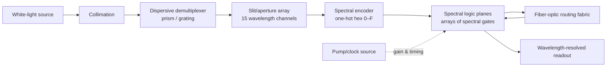
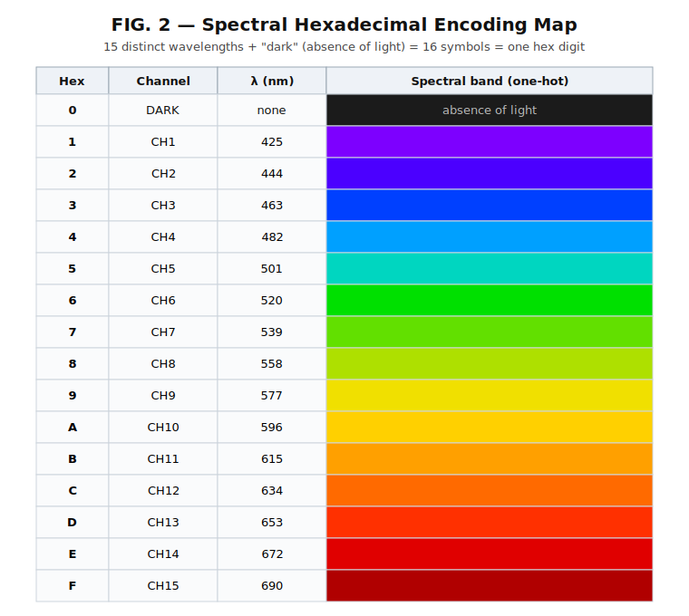
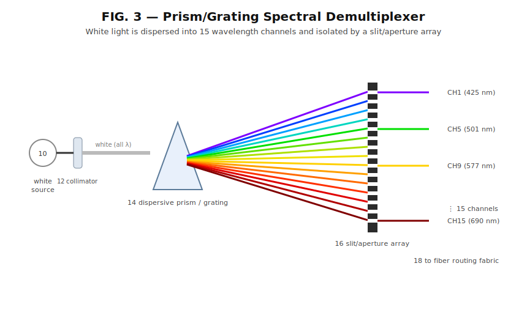
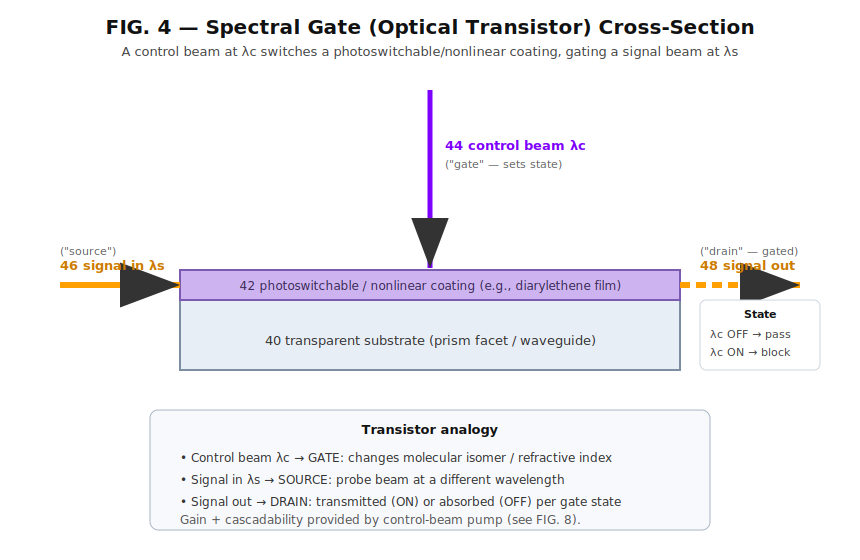
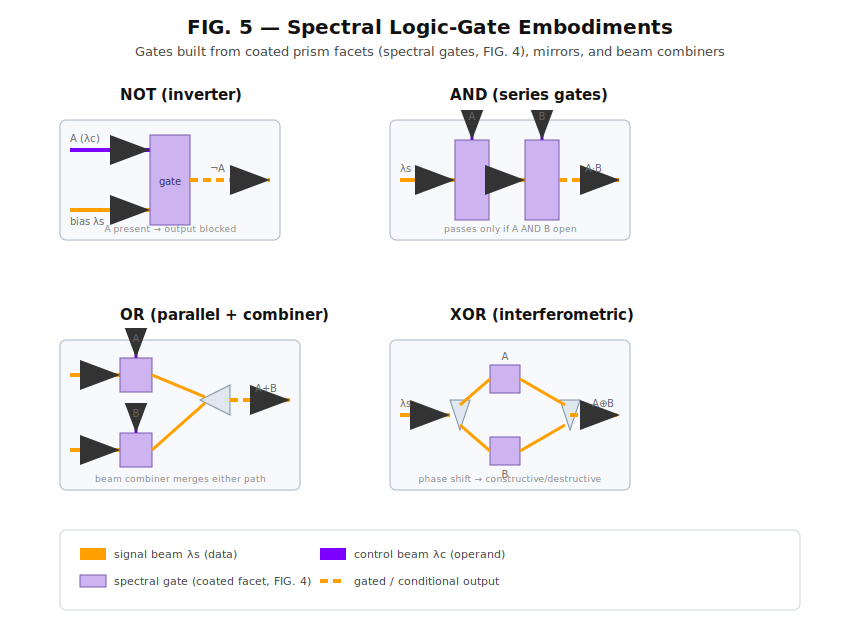
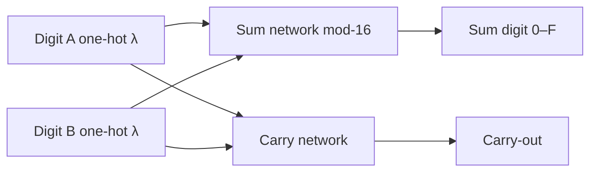
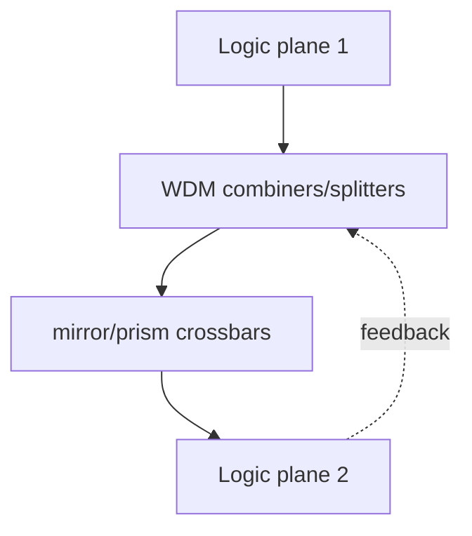
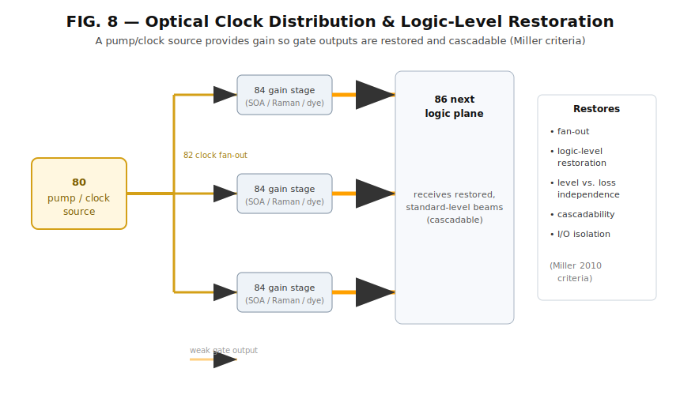
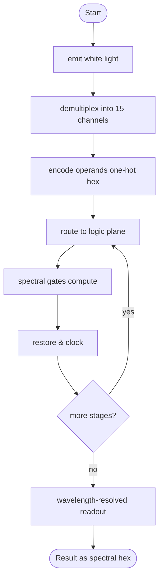

# An All-Photonic Spectral-Hexadecimal Computing Architecture

**Working paper — conceptual draft**

**Author:** Adam Androulidakis 
**Email:** serpentchain@gmail.com 
**Date:** 1 June 2022 
**Updated:** 17 June 2026 

> **Note on scope and rigor.** This is a *concept, design and feasibility* paper, not an
> experimental report. It contains no original laboratory data. Its purpose is to
> assess whether a fully photonic, electronics-free computer that encodes information in
> optical wavelength is physically plausible, to survey the relevant prior art, and to
> identify real materials and an architecture that could realize it. Claims of physical
> behavior are grounded in established optics and materials science and are cited
> informally; quantitative performance figures require simulation and experiment.

---

## Abstract

We examine the feasibility of an all-photonic computing architecture that performs
hexadecimal logic directly in the optical-wavelength domain, with no intermediary
electronic components and no optical-to-electronic-to-optical (OEO) conversion. Information
is encoded using a **one-hot spectral code**: a broadband ("white") source is dispersively
separated into fifteen distinct wavelength channels, and a base-sixteen digit is represented
by the presence of light in exactly one channel (symbols 1–F) or its absence ("dark",
symbol 0). We assess the feasibility of the architecture, evaluating it
component by component: the broadband source and spectral encoding, the dispersive routing
fabric, the gating element, the construction of logic and hexadecimal-arithmetic primitives,
and end-to-end system behavior. Spectral encoding and passive routing with prisms, mirrors,
and fiber are physically sound. The gating element is the element that determines whether the
architecture can compute: it must provide gain and let one beam control another. We identify
**control-switchable coatings** as the gating element: photochromic
photoswitches (e.g., diarylethenes), saturable absorbers (e.g., graphene), optically nonlinear
(Kerr/χ³) media, and chalcogenide phase-change films, in which a control beam at one wavelength
gates a signal beam at another, yielding a genuine optical transistor with gain, fan-out,
logic-level restoration, cascadability, and input/output isolation. Granting an active gate,
we show the remaining architecture — a non-von-Neumann dataflow of "spectral gates" with
logic and hexadecimal-arithmetic primitives — is constructible in principle, and we identify
the open practical question that ultimately governs feasibility: the net energy, gain, and
crosstalk budget through a deep cascade. We conclude that the architecture is **feasible in
principle but unproven in practice**, and that its viability hinges on system-level cascade
performance rather than on any single component.

**Keywords:** optical computing, photonic logic, wavelength encoding, all-optical
transistor, photochromism, nonlinear optics, phase-change materials, non-von-Neumann,
dataflow architecture.

---

## 1. Introduction

Electronic digital computers are approaching physical limits in interconnect energy and
memory bandwidth (the "von Neumann bottleneck"), and they incur conversion costs whenever
they interface with optical communication links. Optical computing seeks to perform
computation in the optical domain itself, exploiting the bandwidth, parallelism, and low
propagation loss of light.

This paper develops a specific and unusually direct idea: encode information **in color**.
Rather than representing bits as voltage levels, represent a hexadecimal digit as one of
fifteen wavelengths (or "dark"), generate those wavelengths by dispersing white light, and
compute by selectively gating wavelengths with coated optical elements. The appeal is
conceptual economy — the data carrier (wavelength) is also the physical quantity the optics
naturally manipulate — and the promise of a machine that never leaves the optical domain.

We ask three questions:

1. **Is it physically valid?** Which elements of the design obey known physics, and which
   do not?
2. **Does it already exist?** What prior art covers wavelength-based and all-optical logic?
3. **If not, how could it be built?** What real materials and architecture would make a
   *programmable* version work?

Our central finding is that the architecture is feasible in principle: with an active,
control-switchable coating as the gating element, every stage from white light to
hexadecimal arithmetic rests on sound physics. The gate must be active — a control beam at one
wavelength changing the response seen by a signal beam at another — and several material
classes provide exactly this behavior. The substantive open question is a system-level one
(the cascade energy, gain, and crosstalk budget), not the viability of the architecture itself.

### 1.1 Contributions

- A clear-eyed **feasibility analysis** of each component, establishing which stages rest on
  settled physics (dispersion, one-hot spectral encoding, optical routing) and which require
  an active element (the gate).
- A **one-hot spectral-hexadecimal encoding** (15 wavelengths + dark = 16 symbols) and its
  rationale.
- A **spectral-gate** (optical-transistor) element and a survey of **real coating
  materials** that realize control-of-light-by-light.
- A **non-von-Neumann dataflow architecture**, including logic-gate and hexadecimal-adder
  constructions, optical clocking/restoration, and co-located optical memory.
- A frank **limitations and roadmap** section identifying what must be measured or simulated.

---

## 2. Background and Related Work

### 2.1 Optical and photonic computing

Optical computing is a mature research field. Modern photonic accelerators (from industrial
and academic groups) perform linear algebra optically while retaining electronic control;
these are *hybrid* and incur OEO conversion. Fully optical, general-purpose machines remain
elusive, largely because optical logic has historically lacked an element with transistor-
like gain and cascadability.

### 2.2 Wavelength-based and prism/mirror computing

The closest prior art to the present concept is **wavelength-based computing** (Goliaei &
Jalili, 2009), in which prisms and mirrors discriminate wavelengths to solve the 3-SAT
problem. This demonstrates that prism/mirror optics can encode and separate problem variables
by wavelength — but the device is **passive and problem-specific**: it explores solution
space by construction rather than executing programmable logic, and it does not cascade into
arbitrary-depth computation.

### 2.3 Optical transistors and logic gates

The optical-transistor concept appears in the patent record (Jain & Pratt, U.S. 4,382,660,
1983) and in numerous device demonstrations: microring/microresonator switches,
electromagnetically-induced-transparency (EIT) cavity devices, Rydberg single-photon
transistors, exciton/polariton switches, and single-atom-in-cavity gates. All-optical logic
gates (e.g., a photonic NOR via microring resonators, Ibrahim et al., 2004) have been shown.
These confirm that **one light beam controlling another is experimentally real**.

### 2.4 Benchmarks for an optical logic element

Miller (2010) articulates five properties any practical optical logic device should satisfy:
**fan-out**, **logic-level restoration**, **logic level independent of loss**,
**cascadability**, and **input/output isolation**. We adopt these as the acceptance criteria
for our spectral gate (Section 5, Section 7).

### 2.5 Wavelength-division multiplexing and phase-change photonics

WDM telecom routinely carries many wavelengths in one fiber — directly relevant to our
routing fabric. Photonic in-memory computing with chalcogenide phase-change materials (e.g.,
Ríos, Youngblood, Bhaskaran et al., 2019) demonstrates optically switched, non-volatile
states usable for both logic and memory.

### 2.6 Gap

The **broad** ideas exist, but the **specific synthesis** — a broadband white-light source +
15-channel one-hot spectral-hexadecimal encoding + photoswitchable/nonlinear-coated prism
"spectral gates" + a fully passive free-space-plus-fiber, non-von-Neumann dataflow with
optical clocking and gain-based restoration — does not appear as a single, described system.
That synthesis is the subject of this paper.

---

## 3. Physical-Feasibility Analysis

We separate the concept into claims and assess each against established physics.

### 3.1 What is valid

| Claim | Verdict | Physical basis |
| --- | --- | --- |
| White light → ~15 discrete wavelength bands | Valid | Chromatic dispersion (prism) or diffraction (grating) angularly separates wavelengths; a slit/aperture array isolates discrete bands. |
| Hexadecimal as 15 wavelengths + "dark" | Valid | 15 present-wavelength symbols + 1 absence symbol = 16 = one hex digit; a legitimate one-hot code. |
| Routing with mirrors, prisms, fiber | Valid | Geometric optics and waveguiding; WDM already multiplexes many wavelengths per fiber. |
| Wavelength-selective coatings pass/absorb chosen bands | Valid | Wavelength-selective absorption (Beer–Lambert); suitable for static encoding, routing, masking. |

### 3.2 Where a passive element is insufficient

| Claim | Verdict | Why it fails |
| --- | --- | --- |
| A **passive, linear coating can act as a transistor** | Invalid | A transistor needs **gain** and **one signal controlling another**. Linear, passive absorbers (dyes, fixed filters) produce output proportional to input, and one beam cannot control a second — photons do not interact in a linear medium. |
| A purely passive prism-and-filter network is a universal computer | Invalid | Without an active/nonlinear element there is **no gain, fan-out, restoration, or cascadability** (failing Miller's criteria). Such a network performs only fixed **filtering/masking** logic, not programmable computation. |

### 3.3 The active-gate requirement

The architecture — white light, prisms, mirrors, fiber, and a **coating on each gate** — rests
on sound physics provided the gate coating is **active**: a **photoswitchable or optically
nonlinear material** in which a **control beam at λc changes the response seen by a signal beam
at λs**. By definition this is light controlling light — an optical transistor (Sections 4–5).
An active gate is what makes the system a **programmable optical computer** rather than a
passive optical filter, and it is the core scientific point of the paper.

---

## 4. System Architecture

### 4.1 Overview

The machine is organized as a one-directional **optical dataflow** rather than a stored-program
von Neumann pipeline: operands flow as light through a spatial network of logic planes, and
results propagate directly to downstream consumers. There is no shared bus and no central
program counter; memory, where needed, is optical and co-located with logic.

*Figure 1. System architecture (dataflow organization).*

### 4.2 Spectral hexadecimal encoding

A hex digit is a **one-hot spectral code** over sixteen symbols: channels CH1–CH15 encode
symbols 1–F, and "dark" encodes 0. In one embodiment the channel centers are approximately
425, 444, 463, 482, 501, 520, 539, 558, 577, 596, 615, 634, 653, 672, and 690 nm, spaced to
exceed the demultiplexer's spectral resolution and the coatings' bandwidth.

*Figure 2. One-hot spectral hexadecimal encoding (15 wavelengths + dark → 0–F).*

One-hot encoding is chosen because (i) each symbol is a single physical wavelength that can be
independently filtered, routed, and gated; (ii) symbol detection reduces to presence/absence
thresholding; and (iii) multiple digits can share a fiber by WDM. Multi-digit words use
spatial parallelism (one path per digit) or time multiplexing under the optical clock.

The choice of **base sixteen specifically** is motivated by data representation rather than
optics alone. Hexadecimal is already the conventional shorthand for binary data — one hex digit
maps to exactly four bits, and bytes, addresses, and machine words are routinely expressed in
hex. Computing natively in base sixteen therefore keeps the machine's internal representation
aligned with how data is already written and stored, so that — should photonic storage
technologies for this architecture be produced — data held in base sixteen could be read,
written, and operated on with **less translation and obfuscation** between the storage layer,
the applications that consume the data, and the optical compute layer. The radix is chosen to
minimize representational mismatch across that stack, not merely to fit the available channel
count.

### 4.3 Source and demultiplexer

A broadband source (supercontinuum, broadband superluminescent assembly, or phosphor-converted
emitter) is collimated and dispersed; a slit/aperture array isolates the fifteen channels.

*Figure 3. Prism/grating spectral demultiplexer with slit array.*

---

## 5. The Spectral Gate (Optical Transistor)

### 5.1 Principle

A spectral gate has a transparent substrate (prism facet or waveguide) bearing an active
coating. A **control beam (λc)** illuminates the coating; a **signal beam (λs)** propagates
through/along the substrate. The control beam alters the coating's absorption, refractive
index, or phase as seen by the signal beam, switching the signal output between transmitting
("ON") and blocking/phase-shifted ("OFF") states. The mapping onto a transistor is direct:
control = gate, signal-in = source, signal-out = drain.

*Figure 4. Spectral gate: a control beam switches a coating that gates a signal beam.*

### 5.2 Candidate materials

| Class | Mechanism | Representative materials | Notes |
| --- | --- | --- | --- |
| Photochromic photoswitches | Control beam isomerizes molecule → absorption shift | **Diarylethenes** (primary), spiropyrans, azobenzenes, fulgides, DASAs, Ru-sulfoxide complexes | Diarylethenes: thermally stable, fatigue-resistant; coordination complexes: ultrafast (ps–ns) |
| Saturable absorbers | Absorption falls at high intensity (thresholding) | Graphene (UV→THz), carbon nanotubes, quantum dots, organic dyes | Broadband; ultrafast recovery |
| Nonlinear (Kerr/χ³, χ²) media | Cross-phase modulation, four-wave mixing | Chalcogenide/silicon waveguides; BBO, KTP, LiNbO₃ | Basis of true high-speed optical transistors; resonators enhance |
| Phase-change materials | Optically switched amorphous↔crystalline | Ge₂Sb₂Te₅ (GST) | Non-volatile; doubles as memory |

A passive, linear coating has no gain and is not cascadable; such coatings serve only as
**fixed masking** elements (static routing or read-only masks).

### 5.3 Meeting the acceptance criteria

Gain for **fan-out** and **logic-level restoration** is supplied by an optical pump (Section
7.3); **input/output isolation** follows from spectral separation of λc and λs; **cascadability**
and **loss-independent levels** follow from restoration at each stage. Thus the spectral gate
can satisfy Miller's five criteria.

---

## 6. Logic and Hexadecimal Arithmetic

### 6.1 Logic gates

Spectral gates combine with mirrors and beam splitters/combiners into Boolean primitives:

- **NOT:** a bias λs through a gate controlled by A; A present ⇒ λs blocked ⇒ ¬A.
- **AND:** two gates in series on one signal path (operands A, B); output only if both open.
- **OR:** two parallel gated paths merged in a combiner; output if either open.
- **XOR:** an interferometric pair of nonlinear gates imposing differential phase; recombination
  yields A⊕B.

*Figure 5. NOT, AND, OR, and XOR built from spectral gates, mirrors, and combiners.*

### 6.2 Hexadecimal arithmetic

Operating directly on the one-hot code, a sum network maps the input wavelength pair to the
output wavelength representing their sum modulo sixteen, while a carry network emits light when
the sum exceeds F. Cascading with carry propagation yields multi-digit adders and a full
hexadecimal ALU.

*Figure 6. Hexadecimal half-adder operating on the spectral code.*

### 6.3 Wavelength conversion and isolation

Where a gate's output wavelength differs from that expected downstream, an all-optical
wavelength converter (four-wave mixing or difference-frequency generation) translates the
carrier while preserving the logical state — keeping the machine entirely optical.

### 6.4 Interconnect

A fiber routing fabric uses WDM to carry multiple digits per fiber and mirror/prism crossbars
to define the spatial wiring of the dataflow graph (i.e., the program).

*Figure 7. Fiber-optic interconnect / routing fabric.*

---

## 7. Clocking, Restoration, and Memory

### 7.1 Optical clock and gain

A pump/clock source feeds gain stages (semiconductor optical amplifiers, fiber Raman gain, or
pumped active films) at gate outputs, restoring amplitude to standard levels and providing
fan-out so one gate drives several downstream gates.

*Figure 8. Optical clock distribution and logic-level restoration (Miller criteria).*

### 7.2 Memory

Optical memory co-locates with logic: GST phase-change cells hold non-volatile optically-set
states; alternatively, bistable resonators or regenerative feedback loops latch circulating
light. Co-location avoids a processor–memory bus.

### 7.3 Process summary

*Figure 9. Computation process flow.*

---

## 8. Discussion and Limitations

The architecture is plausible in principle but faces real engineering challenges that must be
quantified before any strong performance claim:

1. **Switching speed.** Photochromic isomerization ranges from picoseconds (coordination
   complexes) to microseconds (typical organics); GST switches in nanoseconds; Kerr nonlinearity
   is femtosecond-fast but weak. There is a speed/energy/robustness trade-off across material
   classes, and the chosen coating bounds clock rate.
2. **Switching energy and gain budget.** Each active gate consumes control-beam energy and
   relies on optical gain for restoration. The end-to-end energy per operation, and whether net
   gain can be maintained through deep cascades, are open quantitative questions requiring
   simulation.
3. **Spectral crosstalk and channel count.** Fifteen channels across ~425–690 nm demand coatings
   and filters with sufficiently narrow, well-separated responses; thermal drift and coating
   bandwidth limit how many channels fit and how tightly they pack.
4. **Cascade depth and noise accumulation.** Amplified spontaneous emission, incomplete
   switching contrast, and alignment tolerances accumulate; the practical logic depth between
   regeneration stages is unknown without experiment.
5. **Fatigue and reversibility.** Photochromic films fatigue over cycles (diarylethenes are
   comparatively robust); GST endurance is finite. Device lifetime is material-limited.
6. **Footprint and integration.** Free-space prism/mirror assemblies are bulky and
   alignment-sensitive; an integrated-photonics embodiment (arrayed-waveguide gratings, microring
   spectral gates with switchable cladding) is likely necessary for scale.

Honest summary: **a programmable fully-photonic spectral-hex computer is plausible only with
active gate materials**; quantitative competitiveness with electronics is unproven and is the
crux of any future work.

### 8.8 Order-of-magnitude estimates (untested / inconclusive)

> ⚠️ **These numbers are speculative back-of-the-envelope estimates, not measured results.**
> They are assembled from literature values for the *individual* material classes and
> generic device physics, then combined under simplifying assumptions. They have **not** been
> validated by simulation or experiment in this architecture, the assumptions are unverified,
> and the figures may be off by orders of magnitude. Treat every entry as **inconclusive** and
> for orientation only — its purpose is to identify which parameters matter and roughly where
> they sit, not to claim performance. The bracketed ranges deliberately span wide uncertainty.

**Per-gate switching time and energy (single spectral gate).** Estimated from typical
reported behavior of each coating class; actual values in a packaged spectral gate depend on
mode confinement, coating thickness, contrast target, and wavelength.

| Coating class | Est. switching time | Est. switching energy/op | Volatility | Confidence |
| --- | --- | --- | --- | --- |
| Diarylethene (photochromic) | ~1 µs – 1 ms | ~pJ – nJ | non-volatile | low |
| Ru-sulfoxide / fast photoswitch | ~50 ps – 1 ns | ~pJ – nJ | volatile/meta | very low |
| Saturable absorber (graphene) | ~0.1 – 1 ps recovery | threshold-set (~fJ–pJ) | volatile | low |
| Kerr / χ³ nonlinear | ~fs – ps | ~pJ – nJ (needs high intensity) | volatile | very low |
| GST phase-change | ~1 – 100 ns | ~10 pJ – 1 nJ | non-volatile | low–medium |

**System-level rough estimates (hex half-adder embodiment).** Derived by naive
multiplication of per-gate estimates by an assumed gate count and stage depth; ignores layout,
coupling loss distribution, and control electronics for the pump. **Highly uncertain.**

| Quantity | Speculative estimate | Basis / caveat |
| --- | --- | --- |
| Channels (radix) | 15 + dark = 16 | Set by design; crosstalk-limited in practice |
| Usable channel spacing | ~15–20 nm over ~425–690 nm | Filter/coating bandwidth assumption — untested |
| Single-digit add latency | ~ns – µs | Dominated by slowest coating in cascade |
| Energy per hex operation | ~10 pJ – several nJ | Sum of gate + restoration pump energy; very rough |
| Practical cascade depth before regeneration | ~a few – ~10 stages | Guess; noise/contrast accumulation unmeasured |
| Insertion loss per gate | ~1 – 6 dB | Typical coated-element range; not modeled here |
| Channel crosstalk target | < ~ −20 dB | Required, not demonstrated |

**Comparison framing (do not over-read).** Against a modern CMOS adder (sub-ns latency,
~fJ-class switching energy), these estimates suggest the photonic version is **plausibly
competitive on latency only for fast coatings (Kerr/GST), and likely worse on energy** once
the optical pump/restoration budget is included — but this conclusion is **tentative and
unverified**. The single most decisive unknown is the **net energy and gain budget through a
real cascade**, which only simulation and experiment can settle (Section 9).

**Why these are inconclusive.** (i) Per-material figures come from disparate experimental
contexts (different wavelengths, geometries, contrast definitions) and may not transfer to a
spectral gate. (ii) The gain/restoration budget that makes cascading possible is itself
energy-consuming and is not yet modeled. (iii) Crosstalk, alignment, and thermal drift are
omitted. (iv) No end-to-end simulation has been run. Accordingly, **no performance claim in
this paper should be cited as a result.**

---

## 9. Future Work

- **Single-gate demonstration:** measure switching contrast, speed, energy, and isolation for a
  diarylethene (and a GST) spectral gate at chosen λc/λs.
- **Cascade experiment:** two-to-three gate cascade with optical restoration to test
  cascadability and noise accumulation empirically.
- **System simulation:** end-to-end model of a hex half-adder (channel crosstalk, gain budget,
  timing) to estimate energy/op and maximum logic depth, and to **replace the speculative
  order-of-magnitude estimates of Section 8.8 with validated figures**.
- **Integrated embodiment:** design an arrayed-waveguide-grating demultiplexer with
  microring spectral gates and switchable cladding to remove free-space alignment.
- **Encoding study:** compare one-hot spectral hex against binary-amplitude and phase encodings
  on error tolerance and channel efficiency.

---

## 10. Conclusion

This paper asked whether an *entire* all-photonic, electronics-free spectral-hexadecimal
architecture is feasible — not merely whether any one component works. Taken component by
component, the architecture is feasible in principle. The encoding (dispersing white light into
fifteen channels and representing a hex digit one-hot as 15 wavelengths + dark = 16) and the
passive routing fabric (prisms, mirrors, fiber, demultiplexers) are physically valid and rest
on established optics. The gating element — the one stage that must supply gain and let one
beam control another — is realizable with an **active** coating (photochromic,
saturable-absorbing, nonlinear, or phase-change), which behaves as a genuine optical transistor
meeting the accepted criteria for logic. The choice among these active materials is internal
to the gate, not a limit on the architecture. On top of such gates the logic and
hexadecimal-arithmetic primitives, and a non-von-Neumann dataflow organization, follow
constructively.

The architecture is therefore **feasible in principle**: no step in the chain from white light
to hexadecimal arithmetic violates known physics, provided the gate is active. What remains
unresolved is not any individual component but the **system as a whole** — whether the net
energy, gain, crosstalk, and timing budget survives a deep cascade well enough to be fast,
energy-efficient, and scalable against electronics. That end-to-end budget, not the choice of
coating, is the true determinant of feasibility, and it is an open, experimentally testable
question — the proper subject of the future work above.

---

## References

1. D. A. B. Miller, "Are optical transistors the logical next step?", *Nature Photonics* 4,
   3–5 (2010).
2. S. Goliaei and S. Jalili, "An optical wavelength-based solution to the 3-SAT problem,"
   *Optical SuperComputing* (2009).
3. K. Jain and G. W. Pratt, Jr., "Optical transistors and logic circuits embodying the
   same," U.S. Patent 4,382,660 (assignee MIT; filed 1976, granted 1983).
4. T. A. Ibrahim, K. Amarnath, L. C. Kuo, R. Grover, V. Van, and P.-T. Ho, "Photonic logic
   NOR gate using two symmetric microring resonators," *Optics Letters* 29, 2779–2781 (2004).
5. C. Ríos, N. Youngblood, Z. Cheng, M. Le Gallo, W. H. P. Pernice, C. D. Wright,
   H. Bhaskaran, and A. Sebastian, "In-memory computing on a photonic platform,"
   *Science Advances* 5, eaau5759 (2019).
6. M. Irie, "Diarylethenes for memories and switches," *Chemical Reviews* 100, 1685–1716 (2000).
7. Reviews on photochromism (spiropyrans, azobenzenes, DASAs), saturable absorption
   (graphene, carbon nanotubes, quantum dots), and nonlinear optics (Kerr effect,
   cross-phase modulation, four-wave mixing).

> Disclaimer: 
> Citations are informal and provided for orientation

> There may be inaccuracies in this draft
